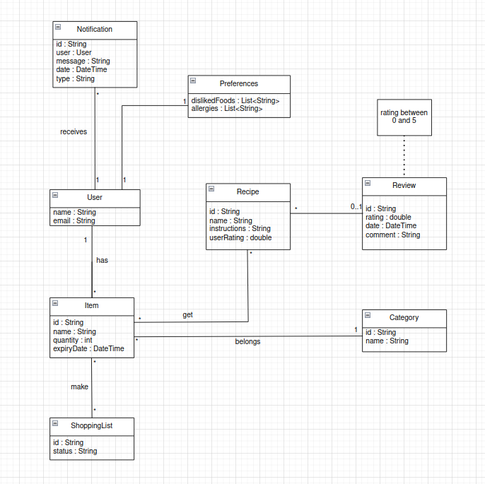

<!-- Template file for README.md for LEIC-ES-2023-24 -->

> [!NOTE] In this file, you’ll find the structure you should follow to document your mobile app in the README.md file for LEIC-ES-2024-25. It’s a single file with guidelines. You can add more sections, but for assessment normalisation and automation, include all sections of this template. Your professors will clarify about specificities of your app.

# MealIdeas Development Report

Welcome to the documentation pages of MealIdeas!

This Software Development Report, tailored for LEIC-ES-2024-25, provides comprehensive details about MealIdeas, from high-level vision to low-level implementation decisions. It’s organised by the following activities. 

- [MealIdeas Development Report](#mealideas-development-report)
  - [Business Modelling](#business-modelling)
    - [Product Vision](#product-vision)
    - [Features and Assumptions](#features-and-assumptions)
    - [Elevator Pitch](#elevator-pitch)
  - [Requirements](#requirements)
    - [User Stories](#user-stories)
    - [Domain model](#domain-model)
  - [Architecture and Design](#architecture-and-design)
    - [Logical architecture](#logical-architecture)
    - [Physical architecture](#physical-architecture)
    - [Vertical prototype](#vertical-prototype)
  - [Project management](#project-management)
    - [Sprint 0](#sprint-0)
    - [Sprint 1](#sprint-1)
    - [Sprint 2](#sprint-2)
    - [Sprint 3](#sprint-3)
    - [Sprint 4](#sprint-4)
    - [Final Release](#final-release)

Contributions are expected to be made exclusively by the initial team, but we may open them to the community, after the course, in all areas and topics: requirements, technologies, development, experimentation, testing, etc.

Please contact us!

Thank you!

• Carlos Cerqueira - up202305021@edu.fe.up.pt  
• Henrique Oliveira - up202305677@edu.fe.up.pt  
• João Ferreira - up202305204@edu.fe.up.pt  
• Manuel Pedro - up202303996@edu.fe.up.pt  
• Paulo Saavedra - up202307477@edu.fe.up.pt  

---
## Business Modelling

Our project aims to develop an app that contributes to the Sustainable Development Goals (SDGs) by promoting smarter meal planning and reducing food waste. While initially designed for the FEUP community, the app has the potential to expand to other institutions, encouraging sustainable food consumption on a larger scale.

The core focus of our app is efficient food management and waste reduction. By helping users track their food inventory, receive meal suggestions based on available ingredients, and get notified about expiration dates, the app encourages more mindful grocery use. This not only saves money and time but also promotes a more sustainable approach to daily cooking habits.

### Product Vision

<!-- 
Start by defining a clear and concise vision for your app, to help members of the team, contributors, and users into focusing their often disparate views into a concise, visual, and short textual form. 

The vision should provide a "high concept" of the product for marketers, developers, and managers.

A product vision describes the essential of the product and sets the direction to where a product is headed, and what the product will deliver in the future. 

**We favor a catchy and concise statement, ideally one sentence.**

We suggest you use the product vision template described in the following link:
* [How To Create A Convincing Product Vision To Guide Your Team, by uxstudioteam.com](https://uxstudioteam.com/ux-blog/product-vision/)

To learn more about how to write a good product vision, please see:
* [Vision, by scrumbook.org](http://scrumbook.org/value-stream/vision.html)
* [Product Management: Product Vision, by ProductPlan](https://www.productplan.com/glossary/product-vision/)
* [How to write a vision, by dummies.com](https://www.dummies.com/business/marketing/branding/how-to-write-vision-and-mission-statements-for-your-brand/)
* [20 Inspiring Vision Statement Examples (2019 Updated), by lifehack.org](https://www.lifehack.org/articles/work/20-sample-vision-statement-for-the-new-startup.html)
-->

MealIdeas, turn the ingredients you have at home into delicious and creative meals.
Our app helps users generate meal ideas based on available ingredients while also tracking stored food, reducing waste, and simplifying meal planning.

### Features and Assumptions
<!-- 
Indicate an  initial/tentative list of high-level features - high-level capabilities or desired services of the system that are necessary to deliver benefits to the users.
 - Feature XPTO - a few words to briefly describe the feature
 - Feature ABCD - ...
...

Optionally, indicate an initial/tentative list of assumptions that you are doing about the app and dependencies of the app to other systems.
-->
- Get recipe suggestions based on your leftover ingredients to reduce food waste.  
- Get notified when items in your stock are about to expire.  
- Receive smart suggestions on what food items to buy based on your inventory.  
- Scan ingredients easily to add them to your inventory.  
- Organize your ingredients with custom categories.  
- Share your favorite recipes with others.  
- Set up your account seamlessly with the Get Started page.  
- Customize your preferences by marking disliked foods or allergies.  

### Elevator Pitch
<!-- 
Draft a small text to help you quickly introduce and describe your product in a short time (lift travel time ~90 seconds) and a few words (~800 characters), a technique usually known as elevator pitch.

Take a look at the following links to learn some techniques:
* [Crafting an Elevator Pitch](https://www.mindtools.com/pages/article/elevator-pitch.htm)
* [The Best Elevator Pitch Examples, Templates, and Tactics - A Guide to Writing an Unforgettable Elevator Speech, by strategypeak.com](https://strategypeak.com/elevator-pitch-examples/)
* [Top 7 Killer Elevator Pitch Examples, by toggl.com](https://blog.toggl.com/elevator-pitch-examples/)
-->

Hi! I'm part of a group of students developing an app to make cooking easier and reduce food waste.

Have you ever opened your fridge, seen a bunch of ingredients, and still had no idea what to cook? That’s exactly the problem we’re solving with MealIdeas! Our app suggests creative and delicious recipes based on what you already have at home. Simply log your ingredients, and MealIdeas will do the rest. Plus, it helps you track your food inventory, so you waste less and plan meals effortlessly.

No more last-minute grocery runs or wasted food—MealIdeas makes cooking simple, efficient, and fun.

So, what’s the last ingredient you forgot at the back of your fridge?

## Requirements

### User Stories
<!-- 
In this section, you should describe all kinds of requirements for your module: functional and non-functional requirements.

For LEIC-ES-2024-25, the requirements will be gathered and documented as user stories. 

Please add in this section a concise summary of all the user stories.

**User stories as GitHub Project Items**
The user stories themselves should be created and described as items in your GitHub Project with the label "user story". 

A user story is a description of a desired functionality told from the perspective of the user or customer. A starting template for the description of a user story is *As a < user role >, I want < goal > so that < reason >.*

Name the item with either the full user story or a shorter name. In the “comments” field, add relevant notes, mockup images, and acceptance test scenarios, linking to the acceptance test in Gherkin when available, and finally estimate value and effort.

**INVEST in good user stories**. 
You may add more details after, but the shorter and complete, the better. In order to decide if the user story is good, please follow the [INVEST guidelines](https://xp123.com/articles/invest-in-good-stories-and-smart-tasks/).

**User interface mockups**.
After the user story text, you should add a draft of the corresponding user interfaces, a simple mockup or draft, if applicable.

**Acceptance tests**.
For each user story you should write also the acceptance tests (textually in [Gherkin](https://cucumber.io/docs/gherkin/reference/)), i.e., a description of scenarios (situations) that will help to confirm that the system satisfies the requirements addressed by the user story.

**Value and effort**.
At the end, it is good to add a rough indication of the value of the user story to the customers (e.g. [MoSCoW](https://en.wikipedia.org/wiki/MoSCoW_method) method) and the team should add an estimation of the effort to implement it, for example, using points in a kind-of-a Fibonnacci scale (1,2,3,5,8,13,20,40, no idea).

-->

### Domain model

<!-- 
To better understand the context of the software system, it is useful to have a simple UML class diagram with all and only the key concepts (names, attributes) and relationships involved of the problem domain addressed by your app. 
Also provide a short textual description of each concept (domain class). 

Example:
 

  

-->

 

  

The user has attributes such as name and email. Each user can have multiple items, each identified by an ID, a name, a quantity, and an expiry date. Every item belongs to a specific category, which helps organize ingredients efficiently by grouping similar items together.

Based on the items a user owns, a shopping list can be created. Each shopping list is tracked by an ID and has a status indicating whether it is pending or completed.

Recipes are identified by an ID, a name, and a set of instructions. Each recipe is associated with multiple ingredients and includes a userRating attribute, allowing users to rate recipes based on their experience.

Notifications keep users informed about important events, such as item expirations or shopping list updates. Each notification has an ID, a message, a date, and a type, and is linked to a specific user. This ensures that users receive relevant updates tailored to their inventory and preferences.

## Architecture and Design
<!--
The architecture of a software system encompasses the set of key decisions about its organization. 

A well written architecture document is brief and reduces the amount of time it takes new programmers to a project to understand the code to feel able to make modifications and enhancements.

To document the architecture requires describing the decomposition of the system in their parts (high-level components) and the key behaviors and collaborations between them. 

In this section you should start by briefly describing the components of the project and their interrelations. You should describe how you solved typical problems you may have encountered, pointing to well-known architectural and design patterns, if applicable.
-->

### Logical architecture
<!--
The purpose of this subsection is to document the high-level logical structure of the code (Logical View), using a UML diagram with logical packages, without the worry of allocating to components, processes or machines.

It can be beneficial to present the system in a horizontal decomposition, defining layers and implementation concepts, such as the user interface, business logic and concepts.

Example of _UML package diagram_ showing a _logical view_ of the Eletronic Ticketing System (to be accompanied by a short description of each package):

-->

### Physical architecture
<!--
The goal of this subsection is to document the high-level physical structure of the software system (machines, connections, software components installed, and their dependencies) using UML deployment diagrams (Deployment View) or component diagrams (Implementation View), separate or integrated, showing the physical structure of the system.

It should describe also the technologies considered and justify the selections made. Examples of technologies relevant for ESOF are, for example, frameworks for mobile applications (such as Flutter).

Example of _UML deployment diagram_ showing a _deployment view_ of the Eletronic Ticketing System (please notice that, instead of software components, one should represent their physical/executable manifestations for deployment, called artifacts in UML; the diagram should be accompanied by a short description of each node and artifact):

-->

### Vertical prototype
<!--
To help on validating all the architectural, design and technological decisions made, we usually implement a vertical prototype, a thin vertical slice of the system integrating as much technologies we can.

In this subsection please describe which feature, or part of it, you have implemented, and how, together with a snapshot of the user interface, if applicable.

At this phase, instead of a complete user story, you can simply implement a small part of a feature that demonstrates thay you can use the technology, for example, show a screen with the app credits (name and authors).
-->

## Project management
<!--
Software project management is the art and science of planning and leading software projects, in which software projects are planned, implemented, monitored and controlled.

In the context of ESOF, we recommend each team to adopt a set of project management practices and tools capable of registering tasks, assigning tasks to team members, adding estimations to tasks, monitor tasks progress, and therefore being able to track their projects.

Common practices of managing agile software development with Scrum are: backlog management, release management, estimation, Sprint planning, Sprint development, acceptance tests, and Sprint retrospectives.

You can find below information and references related with the project management: 

* Backlog management: Product backlog and Sprint backlog in a [Github Projects board](https://github.com/orgs/FEUP-LEIC-ES-2023-24/projects/64);
* Release management: [v0](#), v1, v2, v3, ...;
* Sprint planning and retrospectives: 
  * plans: screenshots of Github Projects board at begin and end of each Sprint;
  * retrospectives: meeting notes in a document in the repository, addressing the following questions:
    * Did well: things we did well and should continue;
    * Do differently: things we should do differently and how;
    * Puzzles: things we don’t know yet if they are right or wrong… 
    * list of a few improvements to implement next Sprint;

-->

### Sprint 0

### Sprint 1

### Sprint 2

### Sprint 3

### Sprint 4

### Final Release

